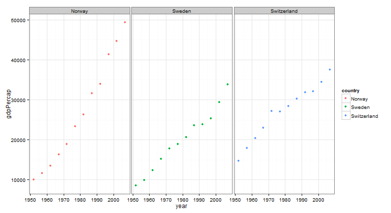
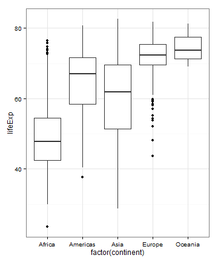
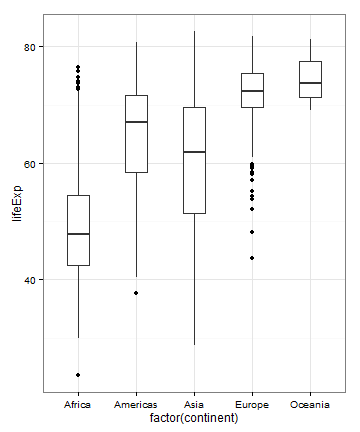

Software Carpentry Final Assigment 06.17.14
========================================================

<<<<<<< HEAD
Trying to get Thinkpad on board.
=======
>>>>>>> 2f1c86183e0733b601ee8eef5a4a56653b809e27

This is an R Markdown document written by Ashley Royston for the final assignment of the UC Davis Software Carpentry Bootcamp June 16-17, 2014.


## Assignment
### Using an Rmd file (in R), create a short analysis report of the gapminder dataset:
1. Move the data file (available [here](http://npk.io/BGRY+)) into your working directory (the one you have been working with for git and github).
2. Take a look at the file and pick three countries you are interested in.
3. Write an Rmd script to load the data file, select all the data for that country (hint, use the subset() function), and use ggplot make a three scatter plots (one for each country) that has year on the x-axis and GDP on the y axis. Make sure you load all the libraries you might need (ggplot2, reshape2, etc). Describe any trends you see for each country using markdown text.
4. Commit your changes using git. You can do this from the command line or in RStudio if you like.
5. Calculate the mean, min, and max life expectancies for each continent (hint: you use aggregate() if you like). Describe what you see in the results using a markdown text.
6. Commit your changes using git and push them to github.
7. Make 2 histograms of global life expectancy using ggplot. One with the default bin widths and one with narrower bin widths (you can check in the pdf from yesterday's lesson for the syntax you might need to do this). Explain the differences and any interesting trends in markdown text.
8. Commit your changes and push them to github.
9. Compile the final Rmd file to html, make sure it looks ok, and then commit this html file as well (should be in your working directory) and push everything to github.


## Work Product
### Loading Datafile and Selecting All Data for Three Countries
Here is an embedded R chunk that sets the working directory, loads required packages, reads in the relevant data file, and selects all the data for Norway, Sweden, and Switzerland, only (script's message suppressed):


```r
<<<<<<< HEAD
=======
<<<<<<< HEAD
=======
setwd("/Users/SE/Desktop/SWC/data")
>>>>>>> 2f1c86183e0733b601ee8eef5a4a56653b809e27
>>>>>>> 16dee49762b75ff6ff1dcd0eb9610914c7535857
require(reshape2)
require(ggplot2)
dat<-read.delim("gapminderDataFiveYear.txt")
dat.three<-subset(dat, subset = country %in% c("Sweden","Switzerland","Norway"))
```


### Embed a Scatter Plot of the Year v GDP Data for the Three Selected Countries
This is an embedded plot, showing three separate scatter plots (made using ggplot2) depicting Year versus GDP data for Norway, Sweden, and Switzerland (script's echo suppressed):

 


### Describe Trends Seen in the Scatter Plot
Trends that can be observed in the above plot include: Norway's GDP has increased by 4x between the 1950s and the 2000s (1952 and 2007, although not visible on this plot); Sweden's GDP has increased by roughly 2.5x between the 1950s and the 2000s; and Switzerland's GDP, while roughly 50% greater than either Norway's or Sweden's in the 1950s, has experienced a slower growth than that of Norway or Sweden (doubling in the same amount of time).


### Calculate the Mean, Min, and Max Life Expectancies by Continent
This embedded segment calculates and displays the mean, minimum, and maximum life expectancies by continent using Xtable (script's echo and message suppressed):

<!-- html table generated in R 3.1.0 by xtable 1.7-3 package -->
<<<<<<< HEAD
<!-- Thu Jun 19 11:08:56 2014 -->
=======
<<<<<<< HEAD
<!-- Thu Jun 19 12:39:46 2014 -->
=======
<!-- Thu Jun 19 10:04:46 2014 -->
>>>>>>> 2f1c86183e0733b601ee8eef5a4a56653b809e27
>>>>>>> 16dee49762b75ff6ff1dcd0eb9610914c7535857
<TABLE style='border:0; border-top: 1px solid grey; border-bottom: 1px solid grey'>
<TR> <TH> Continent </TH> <TH> Mean </TH> <TH> Minimum </TH> <TH> Maximum </TH>  </TR>
  <TR> <TD> Africa </TD> <TD align="right"> 48.87 </TD> <TD align="right"> 23.60 </TD> <TD align="right"> 76.44 </TD> </TR>
  <TR> <TD> Americas </TD> <TD align="right"> 64.66 </TD> <TD align="right"> 37.58 </TD> <TD align="right"> 80.65 </TD> </TR>
  <TR> <TD> Asia </TD> <TD align="right"> 60.06 </TD> <TD align="right"> 28.80 </TD> <TD align="right"> 82.60 </TD> </TR>
  <TR> <TD> Europe </TD> <TD align="right"> 71.90 </TD> <TD align="right"> 43.59 </TD> <TD align="right"> 81.76 </TD> </TR>
  <TR> <TD> Oceania </TD> <TD align="right"> 74.33 </TD> <TD align="right"> 69.12 </TD> <TD align="right"> 81.23 </TD> </TR>
   </TABLE>


### Describe Results Observed in the Above Analyses
The continent with the longest maximum average life expectancy is Asia (~83 years of age), closely followed by Europe and Oceania, trailed by Americas and Africa.  Instead, Africa is observed as having the shortest minimum average life expectancy (~24 years of age) and shortest mean life expectancy (~49 years of age).  The other averages tell of high variance in life expectancy in Asia (mean life expectancy ~60 years of age) and the Americas (mean life expectancy ~65 years of age).


### Embed Two Histograms of Global Life Expectancy (one default formatting, one narrower formatting)
This section contains two embedded histograms concerning the above analyzed and described life expectancy data (script's echo suppressed):

  


### Describe Differences in Above Histograms and Any Interesting Trends
The histograms depict the same information, but one may be preferable to the other at least in terms of aesthetics.  There are interesting trends towards higher average life expectancies (high means *and* lower variances) in Europe and Oceania versus the other continents, towards higher variance in the other countries (most notably in Asia and Americas), and towards lower life expectancies (with the exception of a notable cluster of outliers) in Africa.


